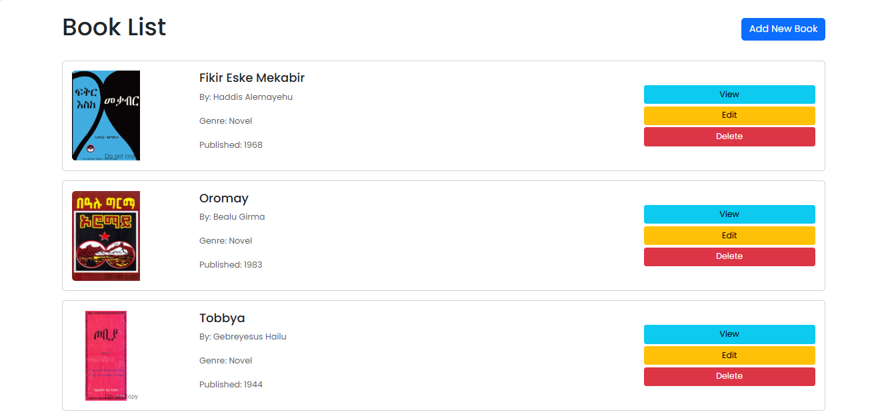
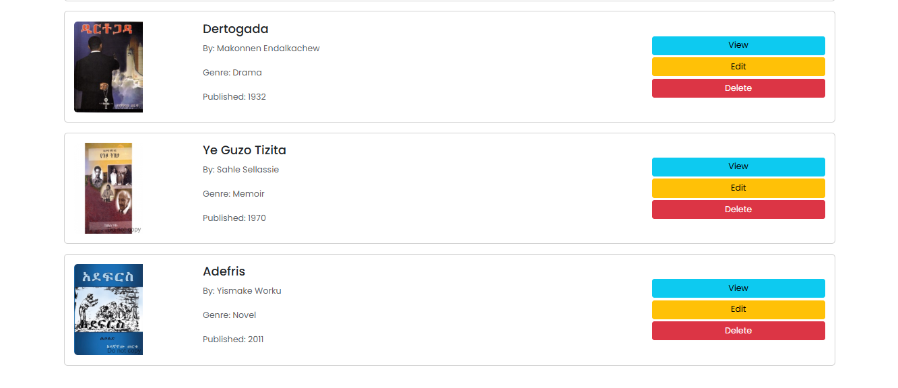
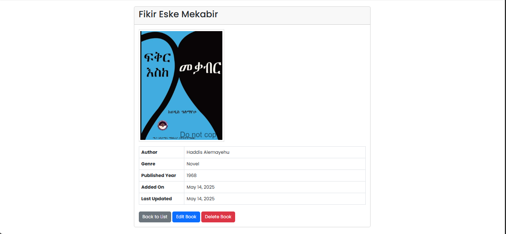
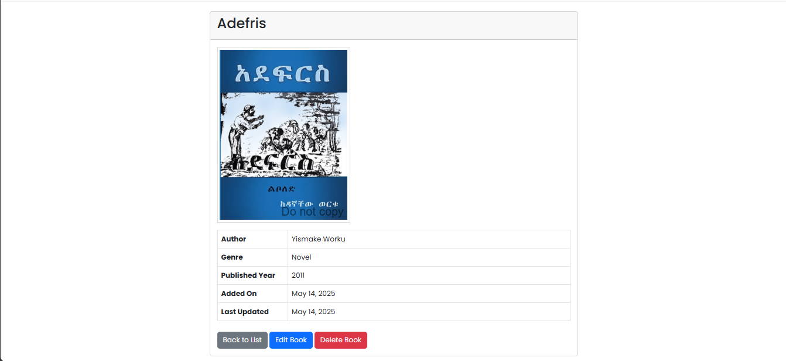
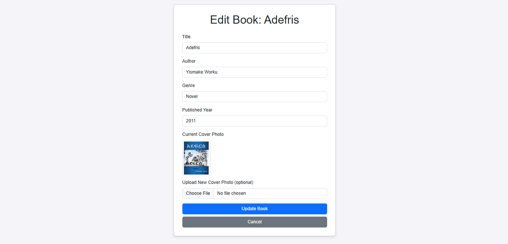
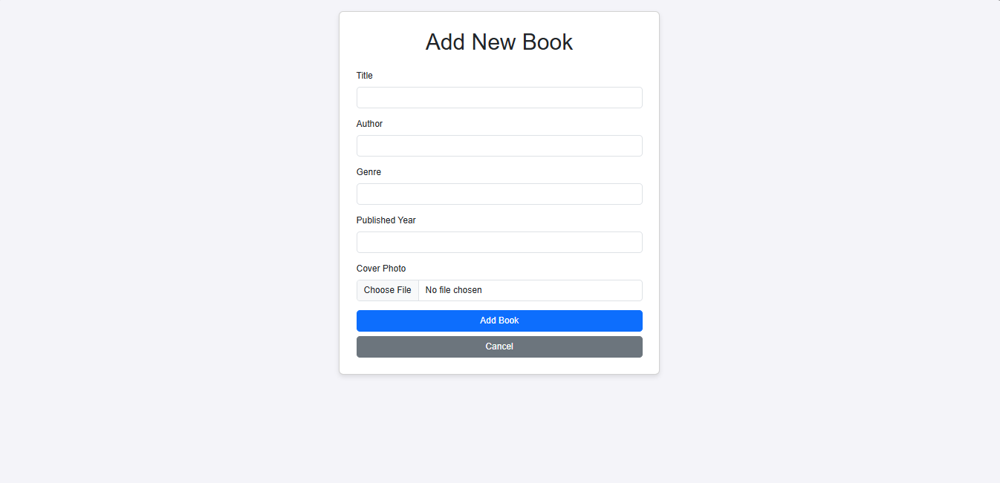

# 📚 Bookstore Laravel App - Your Digital Bookshelf! 📖✨

<p align="center">
  <a href="https://laravel.com" target="_blank"></a>
</p>

Welcome to the **Bookstore Laravel App**! This application is a modern, web-based system for managing a collection of books, built with the elegant Laravel framework. 🚀

## 🌟 About This Project

This project is a PHP bookstore application migrated to the Laravel framework. It allows users to manage a catalog of books, including adding new books, viewing existing ones, updating their details, and removing them from the collection. It features cover photo uploads and a clean, user-friendly interface styled with Bootstrap and the Poppins font.

## 🖼️ Demo








## ✨ Features

-   List Books: View all books in an organized, paginated list.
-   View Book Details: See comprehensive details for a single book.
-   Add New Books: ➕ Easily add new books with title, author, genre, published year, and a cover photo.
-   Edit Books: ✏️ Modify the information of existing books.
-   Delete Books: 🗑️ Remove books from the catalog.
-   Cover Photo Uploads: 🖼️ Upload and display cover images for each book.
-   Database Seeding: Comes with initial data to get you started.
-   Logging: 📝 Detailed logging for all CRUD operations and important events.
-   Responsive Design: 📱 Looks great on all devices thanks to Bootstrap.
-   Redirect to Books: The root URL automatically redirects to the book listing.

## 🛠️ Tech Stack

-   Backend: PHP 8.x, Laravel 10.x
-   Frontend: Blade Templates, Bootstrap 5, Vite (for asset bundling)
-   Database: MySQL
-   Development Environment: XAMPP (or any similar environment supporting PHP, MySQL, Node.js)

## 📋 Prerequisites

Before you begin, ensure you have the following installed:

-   PHP (>= 8.1 recommended)
-   [Composer](https://getcomposer.org/) (PHP dependency manager)
-   [Node.js and npm](https://nodejs.org/) (for Vite and frontend dependencies)
-   A MySQL database server

## 🚀 Getting Started

Follow these steps to get your development environment set up and running:

1. **Clone the Repository (or Navigate to Project Folder):**
   If you're cloning:

    ```bash
    git clone https://github.com/Tesfamichael12/bookstore_laravel_app
    cd bookstore_laravel_app
    ```

    If you already have the project files (like in our current setup):

    ```bash
    cd c:\xampp\htdocs\bookstore_laravel_app
    ```

2. **Install Composer Dependencies:**

    ```bash
    composer install
    ```

3. **Install NPM Dependencies & Build Assets:**

    ```bash
    npm install
    npm run dev
    # Or for production: npm run build
    ```

    _(You might need to run `npm run dev` in a separate terminal if it's a watch process)_

4. **Create Environment File:**
   Copy the `.env.example` file to `.env`:

    ```bash
    cp .env.example .env
    ```

    _(If `.env` already exists from our previous steps, ensure it's correctly configured)._

5. **Generate Application Key:**
   If `APP_KEY` is not already set in your `.env` file:

    ```bash
    php artisan key:generate
    ```

6. **Configure Environment Variables (`.env`):**
   Open the `.env` file and update the following settings, especially your database credentials:

    ```dotenv
    APP_NAME="Bookstore Laravel App"
    APP_URL=http://localhost/bookstore_laravel_app/public # Adjust if your URL is different

    DB_CONNECTION=mysql
    DB_HOST=127.0.0.1
    DB_PORT=3306
    DB_DATABASE=bookstore # Your database name
    DB_USERNAME=root      # Your database username
    DB_PASSWORD=          # Your database password

    LOG_CHANNEL=stack
    LOG_STACK=daily       # Configured for daily log rotation
    LOG_LEVEL=debug
    ```

7. **Run Database Migrations:**
   This will create the `books` table and other necessary Laravel tables.

    ```bash
    php artisan migrate
    ```

8. **Run Database Seeders (Optional but Recommended):**
   This will populate your `books` table with initial sample data.

    ```bash
    php artisan db:seed
    ```

9. **Create Storage Link:**
   This makes the `storage/app/public` directory accessible from the `public` directory, so your uploaded cover photos can be displayed.

    ```bash
    php artisan storage:link
    ```

    _(If you encounter issues on Windows, you might need to run your terminal as an administrator or delete the `public/storage` symlink if it already exists and is broken)._

10. **Serve the Application:**
    You can use Laravel's built-in server (make sure `npm run dev` is also running for Vite if you haven't built assets):

    ```bash
    php artisan serve
    ```

    Then access the application at `http://127.0.0.1:8000` (or the URL provided by `php artisan serve`).

    Alternatively, if you're using XAMPP, ensure your virtual host or XAMPP configuration points to the `public` directory of your Laravel project (e.g., `http://localhost/bookstore_laravel_app/public`).

## 🎈 Usage

-   Navigate to the root URL of your application (e.g., `http://localhost/bookstore_laravel_app/public` or `http://127.0.0.1:8000`). You will be redirected to the book listing page.
-   Use the "Add New Book" button to add books.
-   Click "View", "Edit", or "Delete" on any book in the list to perform those actions.

## 📝 Logging

-   The application logs important events and CRUD operations.
-   Logs are stored in the `storage/logs` directory.
-   Log rotation is set to `daily`, so a new log file is created each day (e.g., `laravel-YYYY-MM-DD.log`).

## 💡 Future Enhancements (Ideas)

-   User Authentication & Authorization (Roles: Admin, User)
-   Search and Filtering functionality for books
-   Pagination for the book list (if not already implicitly handled by a library)
-   API Endpoints for mobile or third-party integrations
-   Unit and Feature Tests
-   More advanced UI/UX features

---

Happy Coding! 🎉 If you have any questions or run into issues, feel free to open an issue or contribute.
